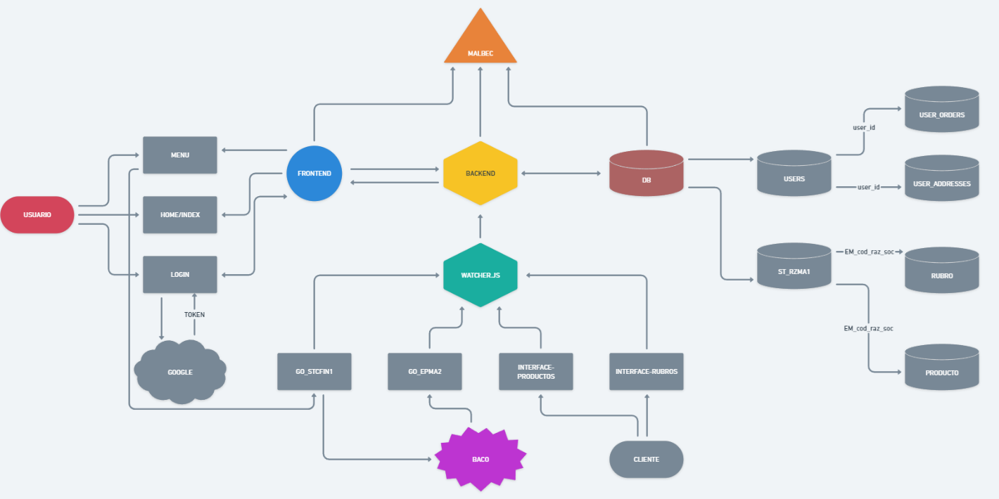
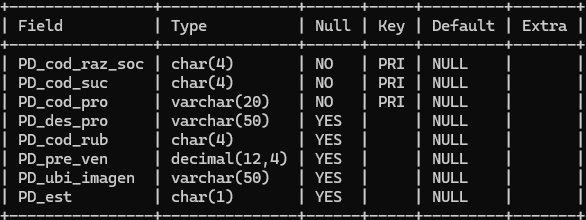
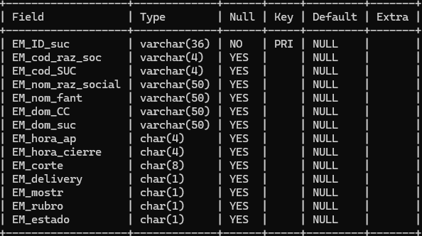
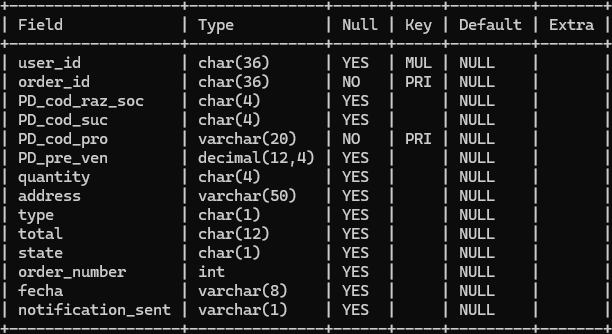
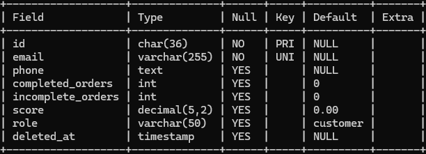

1. Project Overview
Project Name: Satélite Malbec

A web-based application that works alongside DLOFF's propietary software to allows users to order food or other items online for home delivery.
The app provides a simple interface for the client to update his product list and track each order details and status that will be shipped independently.

Stack:
-Frontend: Vite, React, Zustand, React Router, CSS modules, framer-motion
-Backend: Node.js, Express.js
-Database: mySQL
-Authentication: JWT, googleLogin
-Design: Figma

2. Installation Instructions
Prerequisites:

-A windows PC
-an internet browser
-Node.js

Setup Instructions: 
1-Copy the files contained in the client bundle into a folder named 'Malbec' in the C: partition.
2-Copy the shortcut named Malbec to your desktop
3-Open the Malbec shortcut to run the application
4-If prompted, give the required permission to the application to run
5-If not installed, the script will install node.js for you. After, the script will install all the necessary packages for the application to run.

3. Usage
1-Forward your business information to an administrator to be added to the database.
2-Follow the instructions on the txt files, named INTERFACE-PRODUCTO and INTERFACE-RUBRO to upload your items and categories respectively.
3-Once uploaded, the users can start ordering items online.
4-Each time a user places an order, your business will receive an email with the corresponding details.
5-From now on, you have to use DLOFF's software to process the order and its corresponding fiscal information. When the order is processed by the software, an email will  be sent to the user with the order status.

4. API Documentation
Endpoints: Document all the API endpoints, including their methods (GET, POST, DELETE, etc.), parameters, request/response examples, and error codes.
Data Models: Describe the data structures used, such as database schemas or object models.
Authentication: Explain how authentication is handled, including token generation, validation, and expiration.

<h2>Endpoints</h2>

<h3>/api/get_businesses</h3>

-Method: GET

-Description: Retrieves a list of all businesses in the database.

-Response: JSON array of business objects

-Error Codes: 200(ok), 201(no items), 500 (Internal Server Error)

<h3>/api/productos</h3>

-Method: POST

-Payload: business internal code (raz_social)

-Description: Retrieves a list of all productos in the database for a specific business.

-Response: JSON array of business products

-Error Codes: 400(no payload), 200(ok), 201(no items), 500 (Internal Server Error)

<h3>/api/rubros</h3>

-Method: POST

-Payload: business internal code (raz_social)

-Description: Retrieves a list of all categories in the database for a specific business.

-Response: JSON array of business categories

-Error Codes: 400(no payload), 200(ok), 201(no items), 500 (Internal Server Error)

<h3>/api/checkout</h3>

-Method: POST

-Payload: order details (user_Id: userId,
                         PD_cod_raz_soc: product.PD_cod_raz_soc,
                         PD_cod_suc: product.PD_cod_suc,
                         PD_cod_pro: product.PD_cod_pro,
                         PD_pre_ven: product.PD_pre_ven,
                         quantity: product.quantity,
                         address: address.address,
                         type: address.type,
                         total: total,
                         state: 1,
                         receptor: receptor)

-Description: creates a written line to be processed by the software and uploads the order details to the database.

-Response: confirmation

-Error Codes: 400(invalid or inexistent payload), 200(ok), 500 (Internal Server Error)

<h3>/api/register</h3>

-Method: POST

-Payload: email,phone,role 

-Description: registers user

-Response: confirmation

-Error Codes: 400(no payload), 200(ok), 500 (Internal Server Error)

<h3>/api/check_user</h3>

-Method: POST

-Payload: email

-Description: checks user existence

-Response: confirmation

-Error Codes: 400(no payload), 200(exists: true||false), 500 (Internal Server Error)

<h3>/api/add_address</h3>

-Method: POST

-Payload: userId, address

-Description: adds addresses to the database

-Response: confirmation

-Error Codes: 400(no payload), 200(ok), 500 (Internal Server Error)

<h3>/api/get_address</h3>

-Method: POST

-Payload: userId

-Description: retrieves a list of addresses for a specific user

-Response:  JSON array of user addresses

-Error Codes: 400(no payload), 200(ok), 500 (Internal Server Error)

<h3>/api/delete_user</h3>

-Method: POST

-Payload: userId

-Description: soft deletes specific user user

-Response:  confirmation

-Error Codes: 400(no payload), 200(ok), 500 (Internal Server Error)

<h3>/upload/rubro</h3>

-Method: POST

-Payload: parsed rubro data

-Description: uploads categories to the db

-Response:  confirmation

-Error Codes: 400(no payload), 200(ok), 500 (Internal Server Error)

<h3>/upload/producto</h3>

-Method: POST

-Payload: parsed producto data

-Description: uploads productos to the db

-Response:  confirmation

-Error Codes: 400(no payload), 200(ok), 500 (Internal Server Error)

<h3>/upload/estado_pedido</h3>

-Method: POST

-Payload: parsed estado_pedido data

-Description: updates order state in db

-Response:  confirmation

-Error Codes: 400(no payload), 200(ok), 500 (Internal Server Error)

<h2>App Structure</h2>

Detailed map of the app structure

<h2>mySQL Database Schema</h2>

Database table for the product model

CREATE TABLE `producto` (
  `PD_cod_raz_soc` char(4) NOT NULL,
  `PD_cod_suc` char(4) NOT NULL,
  `PD_cod_pro` varchar(20) NOT NULL,
  `PD_des_pro` varchar(50) DEFAULT NULL,
  `PD_cod_rub` char(4) DEFAULT NULL,
  `PD_pre_ven` decimal(12,4) DEFAULT NULL,
  `PD_ubi_imagen` varchar(50) DEFAULT NULL,
  `PD_est` char(1) DEFAULT NULL,
  PRIMARY KEY (`PD_cod_raz_soc`,`PD_cod_suc`,`PD_cod_pro`),
  KEY `PD_cod_raz_soc` (`PD_cod_raz_soc`,`PD_cod_suc`,`PD_cod_rub`),
  CONSTRAINT `producto_ibfk_1` FOREIGN KEY (`PD_cod_raz_soc`, `PD_cod_suc`, `PD_cod_rub`) REFERENCES `rubro` (`RB_cod_raz`, `RB_cod_suc`, `RB_cod_rub`)
) ENGINE=InnoDB DEFAULT CHARSET=utf8mb4 COLLATE=utf8mb4_0900_ai_ci;

Database table for the category model

CREATE TABLE `rubro` (
  `RB_cod_raz` char(4) NOT NULL,
  `RB_cod_suc` char(4) NOT NULL,
  `RB_cod_rub` char(4) NOT NULL,
  `RB_des_rub` varchar(50) DEFAULT NULL,
  `RB_est` char(1) DEFAULT NULL,
  PRIMARY KEY (`RB_cod_raz`,`RB_cod_suc`,`RB_cod_rub`)
) ENGINE=InnoDB DEFAULT CHARSET=utf8mb4 COLLATE=utf8mb4_0900_ai_ci;

Database table for the business model

CREATE TABLE `st_rzma1` (
  `EM_ID_suc` varchar(36) NOT NULL,
  `EM_cod_raz_soc` varchar(4) DEFAULT NULL,
  `EM_cod_SUC` varchar(4) DEFAULT NULL,
  `EM_nom_raz_social` varchar(50) DEFAULT NULL,
  `EM_nom_fant` varchar(50) DEFAULT NULL,
  `EM_dom_CC` varchar(50) DEFAULT NULL,
  `EM_dom_suc` varchar(50) DEFAULT NULL,
  `EM_hora_ap` char(4) DEFAULT NULL,
  `EM_hora_cierre` char(4) DEFAULT NULL,
  `EM_corte` char(8) DEFAULT NULL,
  `EM_delivery` char(1) DEFAULT NULL,
  `EM_mostr` char(1) DEFAULT NULL,
  `EM_rubro` char(1) DEFAULT NULL,
  `EM_estado` char(1) DEFAULT NULL,
  PRIMARY KEY (`EM_ID_suc`)
) ENGINE=InnoDB DEFAULT CHARSET=utf8mb4 COLLATE=utf8mb4_0900_ai_ci;

Database table for the user addresses model

CREATE TABLE `user_addresses` (
  `id` char(36) NOT NULL,
  `user_id` char(36) DEFAULT NULL,
  `address` text NOT NULL,
  `address_type` char(1) DEFAULT NULL,
  `created_at` timestamp NULL DEFAULT CURRENT_TIMESTAMP,
  `updated_at` timestamp NULL DEFAULT CURRENT_TIMESTAMP ON UPDATE CURRENT_TIMESTAMP,
  PRIMARY KEY (`id`),
  KEY `user_id` (`user_id`),
  CONSTRAINT `user_addresses_ibfk_1` FOREIGN KEY (`user_id`) REFERENCES `users` (`id`) ON DELETE CASCADE
) ENGINE=InnoDB DEFAULT CHARSET=utf8mb4 COLLATE=utf8mb4_0900_ai_ci;

Database table for the user orders model

CREATE TABLE `user_orders` (
  `user_id` char(36) DEFAULT NULL,
  `order_id` char(36) NOT NULL,
  `PD_cod_raz_soc` char(4) DEFAULT NULL,
  `PD_cod_suc` char(4) DEFAULT NULL,
  `PD_cod_pro` varchar(20) NOT NULL,
  `PD_pre_ven` decimal(12,4) DEFAULT NULL,
  `quantity` char(4) DEFAULT NULL,
  `address` varchar(50) DEFAULT NULL,
  `type` char(1) DEFAULT NULL,
  `total` char(12) DEFAULT NULL,
  `state` char(1) DEFAULT NULL,
  `order_number` int DEFAULT NULL,
  `fecha` varchar(8) DEFAULT NULL,
  `notification_sent` varchar(1) DEFAULT NULL,
  PRIMARY KEY (`order_id`,`PD_cod_pro`),
  KEY `user_id` (`user_id`),
  CONSTRAINT `user_orders_ibfk_1` FOREIGN KEY (`user_id`) REFERENCES `users` (`id`)
) ENGINE=InnoDB DEFAULT CHARSET=utf8mb4 COLLATE=utf8mb4_0900_ai_ci;

Database table for the user model

CREATE TABLE `users` (
  `id` char(36) NOT NULL,
  `email` varchar(255) NOT NULL,
  `phone` text,
  `completed_orders` int DEFAULT '0',
  `incomplete_orders` int DEFAULT '0',
  `score` decimal(5,2) DEFAULT '0.00',
  `role` varchar(50) DEFAULT 'customer',
  `deleted_at` timestamp NULL DEFAULT NULL,
  PRIMARY KEY (`id`),
  UNIQUE KEY `unique_email` (`email`),
  UNIQUE KEY `unique_active_email` (`email`,`deleted_at`)
) ENGINE=InnoDB DEFAULT CHARSET=utf8mb4 COLLATE=utf8mb4_0900_ai_ci

5. Contributing
Guidelines: Explain how others can contribute to your project. This may include coding standards, commit message conventions, and the process for submitting pull requests.
Code of Conduct: Include any guidelines for maintaining a respectful and collaborative community.
6. Testing
Testing Instructions: How to run tests for your project, including any required configurations or dependencies.
Testing Frameworks Used: Mention any frameworks or libraries used for testing (e.g., Jest, Mocha).
7. Deployment
Deployment Instructions: Steps for deploying the application to a production environment, including any hosting services or platforms used.
Environment Variables: List any required environment variables and their purposes.
8. Troubleshooting
Common Issues: Document known issues and their solutions or workarounds.
Error Handling: Explain how to interpret error messages and resolve common problems.
9. Licenses and Acknowledgments
License: Specify the license under which your project is distributed (e.g., MIT, GPL).
Acknowledgments: Give credit to any libraries, tools, or contributors that significantly influenced your project.
10. Future Improvements
Roadmap: Outline potential future features or enhancements you plan to implement.
Feedback: Encourage users to provide feedback or suggestions for improvement.
11. Changelog
Version History: Document significant changes, improvements, and bug fixes across versions of your project.
Additional Tips:
Format and Style: Use clear headings, bullet points, and tables to make the documentation easy to read. Markdown is a common format for README files.
Examples and Screenshots: Where applicable, provide code snippets, examples, and screenshots to illustrate functionality.
Clarity: Keep your language clear and concise, avoiding jargon where possible.